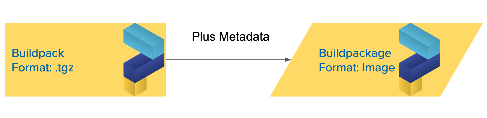

# Task 1: Paketo Artifacts overview

Welcome to the Paketo Buildpacks tutorial.

This repository consists of a couple of branches,
Each branch has a particular task designed to familiarize
you with the Paketo Buildpacks project.

Each subsequent task gets progressively more technical,
so feel free to dive as deep as you would like.

Index:
-
- Task 0: Introduction and The Application Image
- Task 1: **Paketo Artifacts Overview**
- Task 2: Packaging a Buildpack
- Task 3: Packaging a Metabuildpack
- Task 4: Create a custom Metabuildpack
- Task 5: Creating a Builder
- Task 6: Rolling Your Own Implementation Buildpack
- Task 7: The Packit Library

## Paketo Artifacts Overview

Here we are going to walk through the two artifact formats, **buildpacks** and **buildpackages**. As well as take a deeper look into the relationship between **builders**, **metabuildpackages** and **implementation buildpackages**, and how they interact with the `pack` tool.

## Buildpackages vs Buildpacks

So in the previous task we used the following buildpackages when building our application
- `gcr.io/paketo-buildpacks/nodejs`
- `gcr.io/paketo-buildpacks/node-engine`
- `gcr.io/paketo-buildpacks/npm`

The key property of all of these artifacts is that they are images, and live on the [`gcr`](https://cloud.google.com/container-registry) registry.
 
Each **buildpackages** is really just a **buildpack** with some additional metadata, so that it complies with the OCI specification for images.

`pack` can actually use **implementation buildpack archives**
and for the `node-engine` and `npm` buildpackage above, there is a corresponding `.tgz` file artifact with each release.

- [node-engine](https://github.com/paketo-buildpacks/node-engine/releases)
- [npm](https://github.com/paketo-buildpacks/npm/releases)

Unfortunately `pack` cannot use the metabuildpack archives, so they are not released.

For the remainder of this onboarding guide we will use, the work "buildpack" to refer to both the **buildpackage** and **buildpack artifact** release format unless a distinction is required.

## Implementation buildpacks

Implementation buildpacks are the artifact that do all the buildpack logic, they are actually responsible for adding the dependency layers to the final application image.

So the `pack build` using the implementation buildpackages from the previous task, could be represented pictorially as follows:

 We will dive into exactly how each buildpack makes a layer contribution in later tasks.
 
 
 ## Metabuildpacks
 
So while **implementation buildpacks** do all the work around adding dependencies layers, Metabuildpacks provide the ordering and grouping information for a set of buildpacks.

The `nodejs` metabuildpack looks something like this:

Each implementation buildpack runs some `detect` logic to determine if it is needed. The first **group** to have all the buildpacks `detect` successfully will be selected.

All buildpacks within this group will then `build` and add layers to the output image, in a top to bottom order

When we used the `gcr.io/paketo-buildpacks/nodejs` buildpackage in Task 0 this resulted in the following

- Group 1
    - node-engine:  detect_passed
    - yarn-install: detect_failed
- **Group 2**
    - node-engine:  detect_passed
    - npm:          detect_passed

So **Group 2** is selected and the `node-engine` then `npm` buildpacks both `build` and contribute to our final application image.

## Builders

Builders are a an even higher level artifact than metabuildpacks,
they tie together metabuildpacks and a `stack` which functions as the OS layer.

It requires all buildpacks to have metadata indicating they are compatible with the bundled `stack`.

## Stacks

These are the artifacts that provide the underlying **OS layer** in our images. They are composed of two images. One each buildpack adds its layers to during `build`, this is called the **build image**, and a **run image** that all layers are copied to after all buildpacks have run, resulting in our final application image.

